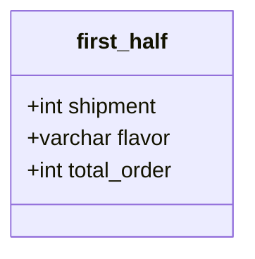

* content
{: toc}





# lv1. 인기있는 아이스크림
상반기에 판매된 아이스크림의 맛을 총주문량을 기준으로 내림차순 정렬하고 총주문량이 같다면 출하 번호를 기준으로 오름차순 정렬

```sql
SELECT flavor
from first_half
order by total_order desc, shipment_id;

 ```


# lv1. 과일로 만든 아이스크림 고르기
상반기 아이스크림 총주문량이 3,000보다 높으면서 아이스크림의 주 성분이 과일인 아이스크림의 맛을 총주문량이 큰 순서대로 조회

```sql
SELECT flavor
from first_half
where total_order>=3000
and flavor in
(select flavor
from icecream_info
where ingredient_type='fruit_based')
order by total_order desc;

```


# lv2. 성분으로 구분한 아이스크림 총 주문량
상반기 동안 각 아이스크림 성분 타입과 성분 타입에 대한 아이스크림의 총주문량을 총주문량이 작은 순서대로 조회

```sql
SELECT I.ingredient_type, sum(F.total_order) as total_order
from first_half F join icecream_info I
on F.flavor = I.flavor
group by I.ingredient_type;
```

