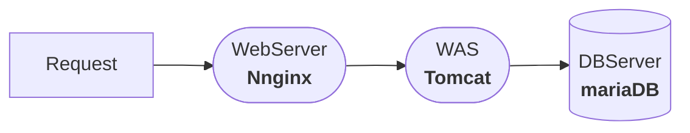

* content
{: toc}


##  3-Tier 구성
> 서버 계층형 구성을 통해 보안 강화 목적




### WEB 서버 연동 확인

> nginx 주소 설정 변경

```shell
sudo vi /etc/nginx/site-enabled/default

location / {
	proxy_pass http://[WAS_SERVER]:8080;
}
# nginx 재구동
systemctl restart nginx
```

### WAS 서버 연결

> tomcat v9.0.4

```shell
# 톰캣 소스 다운로드
wget http://archive.apache.org/dist/tomcat/tomcat-9/v9.0.4/bin/apache-tomcat-9.0.4.tar.gz

# 압축 해제
tar xvzf ./apache-tomcat-9.0.4.tar.gz

#디렉터리 생성
mkdir /usr/local/tomcat

#관련 하위 파일 모두 이동
mv ./apache-tomcat-9.0.4/* /usr/local/tomcat/

#openjdk 설치
sudo apt-get install openjdk-8-jdk

# 톰캣 실행 (8080포트)
./usr/local/tomcat/bin/startup.sh

# 새로운 root 디렉터리 자동 지정됨
# /usr/local/tomcat/webapps/ROOT
```
