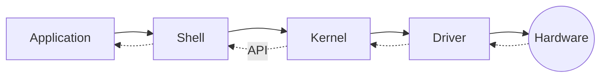

* content
{: toc}


### Ex. 디버그 실습 - Sample02.exe

```c
GetLocalTime(&st);
if(st.wYear == iYear) {
	if(st.wMonth == iMonth){
		if(sw.wDay == iDay){
			print("%s", lpString);
		}
	}
}
```

- SYSTEMTIME 구조체 

```c
typedef struct _SYSTEMTIME {
  WORD wYear;
  WORD wMonth;
  WORD wDayOfWeek;
  WORD wDay;
  WORD wHour;
  WORD wMinute;
  WORD wSecond;
  WORD wMilliseconds;

} SYSTEMTIME, *PSYSTEMTIME, *LPSYSTEMTIME;

```

1. CMP 이후 명령어의 Zero Flag를 1로 강제 변경 


2. SYSTEMTIME 구조체 메모리에 접근해 해당 구조체에 해당하는 year, month, day 값을 강제 변경
- `0x7D5`  ⇒ `0x7E5`
 


3. CMP명령어 이후 `JNZ` ⇒ `JE(JZ)`로 강제 변경


3-1. (HxD) CMP 명령어 이후 JNZ(`75`) ⇒JE(`74`) 어셈블리 강제 변경


4. 지역변수 선언된 값을 현재 값으로 강제 변경

4-1. (HxD) CMP 명령어 이후 지역 변수 선언된 값을 찾아 현재 값으로 강제 변경

5. CMP 명령어 이후 JNZ offset을 0으로 강제 초기화

## 메모리 구조
### Ring Level
- 명령 수행 과정 
	- 권한이 Multi Ring 형태로 `추상화`되어 하드웨어에 직접 접근 불가
	- Kernel 접근 요청 시 API를 제공해 시스템 보호 
	- OS = Shell + Kernel




## WMI 사용하기
> Windows Management Instrumentation, Windows 운영체제에서 데이터 관리 및 작업을 수행하는 도구 API의 집합

```bash
pip install wmi
```
- 새로운 프로세스 생성 실시간 모니터링

```python
import wmi 

# 객체 생성
wmi_ = wmi.WMI() 

# 프로세스 감시기 생성
process_watcher = wmi_.Win32_Process.watch_for("creation") 

while True: 
	new_process = process_watcher() 
	try:        
		print(new_process.CommandLine) #프로세스 생성 명령 내용 출력
		print(dir(new_process)) # 생성된 프로세스 사용 가능한 속성 출력 
		print(new_process.timestamp) # 생성된 프로세스 생성 타임스탬프 출력
		print(new_process.path) # 생성된 프로세스의 경로 출력
		print(new_process.CreationDate) #생성된 프로세스의 생성 날짜 출력
		print(new_process.ExecutablePath) # 생성된 프로세스의 실행파일 경로 출력
		print(new_process.ProcessId) #생성된 프로세스의 PID 출력
		print(datetime.utcfromtimestamp(os.path.getmtime(new_process.ExecutablePath)).strftime('%Y/%m/%d %H:%M:%S'), 
		datetime.utcfromtimestamp(os.path.getatime(new_process.ExecutablePath)).strftime('%Y/%m/%d %H:%M:%S'),
		datetime.utcfromtimestamp(os.path.getctime(new_process.ExecutablePath)).strftime('%Y/%m/%d %H:%M:%S'),)
		# atime = Access , ctime = Creation , mtime = Modification
		proc_owner = new_process.GetOwner() 
		print(proc_owner) # 생성된 프로세스의 소유자 출력
	except:
		pass
```

> **파일의 변조(오염) 확인 사항**
> ▪ 해시 값 동일 여부
> ▪ 파일 크기 변화 여부
> ▪ 작성 시간 변경 여부 